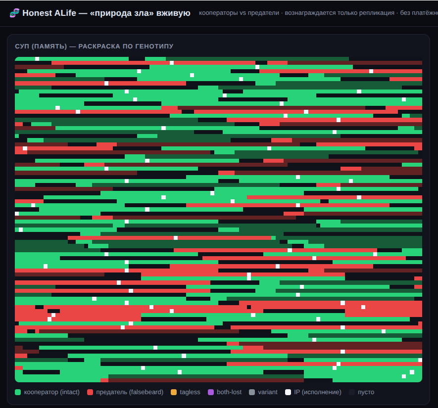
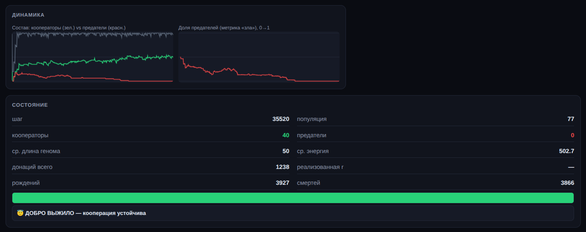
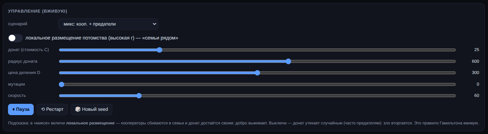

# Honest ALife — честный эксперимент о «природе зла»

Минималистичная, но **научно честная** модель искусственной жизни (наследник *Tierra*),
которая проверяет вопрос на стыке биологии, теории игр и философии: **возникают ли паразитизм и
предательство сами по себе, если вознаграждается только размножение — и при каких условиях
кооперация (добро) способна выжить?**

Главный принцип — **неподстраиваемость**: никакой «функции приспособленности», никакой платёжной
матрицы. «Добро» и «зло» не закладываются, а наблюдаются как эмерджентный исход. Плюс
веб-приложение, которое транслирует эволюцию **в реальном времени**.

<p align="center">
  <br>
  <em>«Суп» (память) вживую: 🟩 кооператоры · 🟥 предатели · белые точки — указатели исполнения (IP).
  Видно, как два типа борются за память.</em>
</p>

---

## 1. Предыстория

В 1990 году эколог **Томас Рей** запустил *Tierra* — цифровую вселенную, где в «супе» (ленте
памяти) жила программа-предок, умевшая лишь одно: копировать себя. Эволюции никто не задавал
цель — был только дефицит памяти, процессорное время как «энергия» и случайные мутации. Через
некоторое время в супе сами собой возникли:

- **паразиты** — программы, потерявшие собственный код копирования и «воровавшие» его у соседей,
  размножаясь почти вдвое быстрее;
- **гиперпаразиты**, иммунитет, «гонки вооружений»;
- **минимизация генома** — выживали те, кто реплицировался за меньшее число инструкций.

Рей ничего из этого не программировал. Вывод *Tierra* стал классическим: **паразитизм
неизбежен** в любой системе, где кто-то строит переиспользуемую структуру.

Отправная точка нашего проекта — образовательный разбор и упрощённая реализация этой идеи.

---

## 2. Контекст

В обычном эволюционном программировании отбор ведёт **внешняя функция приспособленности** —
она и решает, кто «лучше». В системах класса **Artificial Life** такой функции нет: действуют
только размножение, ресурсы и мутации, а всё остальное — следствие.

Здесь возникает тонкий, но решающий вопрос **честности**:

> Если запустить симуляцию и увидеть, как появляется «зло» (эксплуатация, безбилетничество), —
> это настоящий эмерджентный результат или мы его незаметно **подстроили** (загрузив выгодность
> зла в физику мира)?

Наивная минимальная реализация Tierra этот вопрос **проваливает**: там «паразиты» — артефакт
багов (нет защиты памяти, поиск по окну находит чужой код). Чтобы ответ был доказуемым, среду нужно
строить как лабораторию с контролями, а не как красивую демонстрацию.

---

## 3. Задачи проекта

1. Построить **честную, неподстраиваемую** среду ALife, где успех = только репликация.
2. Расширить её от паразитизма к **кооперации и предательству** (дилемма «добра и зла»),
   не вводя платёжную матрицу.
3. Сделать паразитизм и предательство **измеримыми** (а не «на глаз»).
4. Доказать честность набором **негативных контролей** (нельзя подстроить незаметно).
5. Прогнать **многосидовый параметрический sweep** и получить честную фазовую диаграмму.
6. Дать **веб-приложение реального времени** для наблюдения и управления экспериментом.

---

## 4. Что представляет наш продукт

Автономный проект на **чистом Python 3 без зависимостей**. Три части:

### Движок — [`engine.py`](engine.py)
Виртуальная машина с собственным набором инструкций; организмы — самокопирующиеся программы.
Ключевые узлы честности:

| Механизм | Зачем |
|---|---|
| **Адресация по шаблонам** | мутации не «роняют» программу мгновенно — среда эволюционно-устойчива |
| **Provenance (`owner[]`) + защита записи** | пишешь только в свой блок; паразитизм **измеряется** как исполнение в чужой памяти |
| **Метаболизм с целочисленной энергией** | ресурс для размножения и валюта для помощи; сохранение проверяется каждый шаг |
| **`DONATE`** | нейтральный примитив переноса энергии «своим» (кооперация) |
| **Дефектор = кооператор минус дарение** | предательство возникает **вычитанием**, дефектор тайм/длина-идентичен (отличие только в дарении) |
| **Классификация по генотипу + измерение родства `r`** | строго, по байтам генома, независимо от событий доната |
| **Независимые потоки случайностей, риск-смертность** | сопоставимость прогонов, отсутствие синхронных «вымираний» |

### Эксперименты — [`experiments/`](experiments/)
- [`controls.py`](experiments/controls.py) — решающие контроли честности (C4/C5/C5b/C12).
- [`sweep.py`](experiments/sweep.py) — фазовая диаграмма → `sweep.jsonl`.

### Веб-приложение — [`webapp/`](webapp/)
Сервер на стандартной библиотеке (`http.server` + Server-Sent Events) транслирует «суп» и
метрики в браузер; фронтенд раскрашивает память по генотипу, подсвечивает указатели исполнения,
рисует живые графики и позволяет менять параметры **на лету**.

### Документы
- [`DESIGN.md`](DESIGN.md) — пред-регистрация: инварианты честности H1–H7, контроли C1–C15,
  гипотезы P1–P3, сетка sweep (зафиксированы **до** запусков).
- [`RESULTS.md`](RESULTS.md) — итог по-человечески + строгая версия.

---

## 5. Выводы по результатам тестирования

**Честность доказана, а не заявлена.** Пройдены гейты:
- **C5 (решающий):** при нулевых ставках (дарение ничего не стоит, дефектор тайм/длина-идентичен)
  систематического вторителя **нет** — чистый дрейф 50/50. ⇒ Субстрат **не предрешает** победителя.
- **C4:** энергия сходится копейка в копейку **каждый шаг** при активных дарениях и всех смертях.
- **C1/C2/C12:** репликация побитово точна, прогон детерминирован, классификация чиста.

**Главный результат — правило Гамильтона возникло само** (без платёжной матрицы). По мере роста
измеренного родства соседей `r` вторжение предателя монотонно рушится:

| Как расселены | родство r | доля предателя | фиксаций предателя из 16 |
|---|---|---|---|
| все вперемешку (чужие) | 0.02 | 0.99 | **16 / 16** 😈 |
| семьи кучнее | 0.30 | 0.90 | 14 / 16 |
| тесные семьи | 0.36 | 0.56 | **3 / 16** ⚔ |
| очень тесные семьи | ~0.40 | 0.41 | 1 / 16 😇 |

**Два вывода:**
1. **Зло — исход по умолчанию.** Когда кооперация стоит ресурса, предатель-«самозванец»
   вытесняет кооператоров в 16/16 прогонов. Любое переиспользуемое благо само порождает
   безбилетника — потому что брать дешевле, чем давать.
2. **Добро выживает только при высоком родстве** — и не «по морали», а по **геометрии**: когда
   помощь достаётся своим. Опознавательный «значок» не спасает (предатель его сохраняет, а
   помогать перестаёт) — спасает лишь то, что ты живёшь среди настоящей родни.

<p align="center">
  <br>
  <em>Исход при высоком родстве: предатели вытеснены (0), кооперация устойчива — «😇 ДОБРО ВЫЖИЛО».
  Слева — графики состава и доли предателей, справа — живые метрики (включая бейдж честности).</em>
</p>

Подробный разбор простыми словами и строгие оговорки — в [RESULTS.md](RESULTS.md).

---

## 6. Развёртывание на новом сервере

### 6.1. Требования
- **Python 3.8+** (разрабатывалось на 3.12). **Зависимостей нет** — только стандартная библиотека.
- Любая Unix-подобная ОС (тестировалось на Ubuntu).

### 6.2. Установка
```bash
# 1. скопировать проект на сервер (git clone / scp / rsync) в каталог, например:
cd /opt && git clone <repo> tierra && cd tierra      # или scp -r tierra user@server:/opt/

# 2. проверить Python
python3 --version            # ожидается 3.8+

# 3. проверить, что движок честен (контроль C1: репликация + детерминизм)
python3 engine.py            # должно вывести: C1: PASS ✅
```

### 6.3. Запуск веб-приложения
```bash
python3 webapp/server.py                 # порт по умолчанию 8000
PORT=80 python3 webapp/server.py         # на привычном HTTP-порту (нужен root/CAP_NET_BIND)
```
Сервер слушает `0.0.0.0` (все интерфейсы) и при старте печатает готовые ссылки, включая
**`http://<IP-сервера>:<порт>`**.

### 6.4. Фаервол (важно для доступа по IP)
Если включён `ufw`/iptables, нужный порт должен быть открыт:
```bash
sudo ufw status                  # посмотреть открытые порты
sudo ufw allow 8000/tcp          # открыть 8000  ...ИЛИ...
PORT=80 python3 webapp/server.py # повесить на уже открытый 80 (тогда просто http://<IP>)
```
> ⚠️ **Безопасность.** Сервер отдаёт визуализацию и позволяет менять параметры симуляции любому,
> кто откроет адрес. Данных, файлов и shell он не раскрывает (только игрушечная симуляция), но на
> публичном IP это всё равно открыто всем. Для приватного показа ограничьте доступ фаерволом по
> исходному IP или закройте порт после демонстрации.

### 6.5. Постоянная работа (продакшн)
**Быстро (nohup):**
```bash
cd /opt/tierra && PORT=80 nohup python3 webapp/server.py > webapp/server.log 2>&1 &
# остановить:  kill <pid из строки запуска>   (или  pkill -f webapp/server.py)
```
**Правильно (systemd) —** создать `/etc/systemd/system/tierra.service`:
```ini
[Unit]
Description=Honest ALife webapp
After=network.target

[Service]
WorkingDirectory=/opt/tierra
Environment=PORT=80
ExecStart=/usr/bin/python3 webapp/server.py
Restart=always
User=root

[Install]
WantedBy=multi-user.target
```
```bash
sudo systemctl daemon-reload
sudo systemctl enable --now tierra      # запустить и добавить в автозагрузку
sudo systemctl status tierra            # проверить
journalctl -u tierra -f                 # смотреть логи
```

### 6.6. Проверка
```bash
curl -s -o /dev/null -w "%{http_code}\n" http://localhost:$PORT/   # ожидается 200
```
Открыть в браузере `http://<IP-сервера>:<порт>` — должна анимироваться сетка «супа».

---

## 7. Управление экспериментом на фронтенде

Откройте приложение в браузере. Слева — «суп» (память), раскрашенный по генотипу, и графики;
справа — состояние и панель управления. **Все ползунки применяются на лету** (мир не
перезапускается), смена **сценария / seed / рестарт** — пересоздают мир.

<p align="center">
  <br>
  <em>Панель управления: сценарий, тумблер «локальное размещение» (ассортативность r), ползунки
  доната/радиуса/деления/мутаций/скорости, кнопки пауза/рестарт/seed.</em>
</p>

### Что вы видите
- **Суп:** 🟩 кооператор · 🟥 предатель (falsebeard) · 🟧 tagless · 🟪 both-lost · ⬜ variant ·
  белые точки — указатели исполнения (IP); тусклые оттенки — зарезервированная под потомка память.
- **Графики:** состав (кооператоры зел. / предатели красн.) и **доля предателей** (метрика «зла»).
- **Полоса** зелёное/красное и **фаза:** «😇 добро выжило / ⚔ борьба / 😈 зло победило».
- **Бейдж «C4 энергия»** — индикатор честности: энергия должна оставаться «сохранена ✓».

### Сценарии (выпадающий список «сценарий»)
Каждый сценарий — это другой стартовый мир; смена пересоздаёт симуляцию.

- **`микс: кооп. + предатели`** — основной эксперимент про «добро и зло». Засевается поровну
  кооператоров и предателей; наблюдаете, кто победит. Метрики «кооператоры / предатели» и «доля
  предателей» здесь осмысленны. Именно тут переключение **локального размещения** показывает
  правило Гамильтона (добро выживает при высокой родственности, зло вторгается при низкой).
- **`чистые кооператоры (+мутации → P2)`** — засеваются только кооператоры. Включите ползунок
  **мутации** — и увидите, как предатель **рождается сам** (точечная мутация ломает дарение) и
  начинает вторгаться. Это демонстрация вывода **P2: «зло возникает само», без посева**.
- **`предок (паразитизм)`** — классическая *Tierra*: один предок-репликатор, без слоя
  кооперации. Показывает исходный феномен Рея — **паразитизм** (исполнение чужого кода) и
  заполнение памяти. ⚠️ Здесь счётчики «кооператоры/предатели» = 0, а фаза — «нет зрелых»: это
  **нормально**, предок не относится к кооператорам/предателям (другой генотип). Смотрите на сам
  **суп** (как он заполняется и как мутанты используют чужой код), а не на метрику «зла».

### Контроли
| Элемент | Что делает | Что наблюдать |
|---|---|---|
| **Сценарий** | выбор стартового мира (см. «Сценарии» выше) | смена пересоздаёт мир |
| **Локальное размещение** (тумблер) | потомство рядом с родителем = высокое родство «семьи рядом» | **ключевой эксперимент:** вкл → добро выживает; выкл → зло вторгается |
| **Донат (стоимость C)** | сколько энергии отдаёт кооператор | 0 — нулевой контроль (никто не выигрывает систематически); больше — дороже быть добрым |
| **Радиус доната** | как далеко ищется получатель помощи | мал — помощь только ближним; велик — утекает дальним/чужим |
| **Цена деления D** | энергия на размножение | поднимите так, чтобы дарение реально мешало донору (репродукционно-лимитированный режим) |
| **Мутации** | вероятность ошибки копирования | в сценарии `чистые кооператоры` включите — увидите, как предатель **рождается сам** |
| **Скорость** | шагов симуляции за кадр | быстрее эволюция / плавнее картинка |
| **⏸ Пауза · ⟲ Рестарт · 🎲 Новый seed** | пауза · перезапуск сценария · другой случайный посев | детерминизм: один seed → один и тот же прогон |

### Готовые рецепты: «правило Гамильтона» за минуту

Во всех трёх — сценарий **`микс: кооп. + предатели`**, после смены настроек жмите **⟲ Рестарт**.

#### 🔴 Чтобы **зло победило** (предатели вытесняют кооператоров, ~16 из 16)
Нужен режим, где **быть добрым дорого**, а **помощь утекает чужим**:

| Контрол | Значение | Почему |
|---|---|---|
| **Локальное размещение** | **ВЫКЛ** ⬅ ключевое | чужие вперемешку, низкое родство (r≈0.02) — подарок достаётся случайному, часто предателю |
| **Цена деления D** | **≈ 340–360** | репродукционно-лимитированный режим: энергии впритык, отданное реально тормозит донора |
| **Донат (стоимость C)** | **≈ 60–80** | дарение должно дорого стоить, иначе при профиците оно бесплатно |
| **Радиус доната** | **≈ 600** | донат срабатывает и «растекается» на случайных/предателей |
| **Мутации** | 0 | предатели уже посеяны |

→ график «доля предателей» ползёт к **1.0**, зелёные исчезают, внизу: **😈 «ЗЛО ПОБЕДИЛО»**.

#### 🟢 Чтобы **добро выжило** (кооперация устойчива)
Те же дорогие условия, меняем только одно:

- **Локальное размещение → ВКЛ** (семьи держатся вместе, помощь достаётся своим) → Рестарт.

→ предатели больше не вторгаются, внизу: **😇 «ДОБРО ВЫЖИЛО»**. Поменялась не «мораль», а только
**геометрия — кто кому сосед**.

#### ⚪ Проверка честности (нулевой контроль)
- **Донат → 0** → исход становится случайным **50/50** при любом размещении: доказательство, что
  «стол не наклонён» (см. контроль **C5**).

> **Частая ошибка**, из-за которой «зло не побеждает»: оставить **донат маленьким** (≤40) или
> **D низким** (≤300). Тогда у всех профицит энергии, дарение ничего не стоит, и предатель не
> получает преимущества — будет просто дрейф ~50/50, а не вторжение.

---

## 8. Воспроизвести научную часть

```bash
python3 engine.py                  # контроль C1 (репликация, детерминизм, ноль паразитизма)
python3 experiments/controls.py    # гейты честности C4 / C5 / C5b / C12
python3 experiments/sweep.py       # фазовая диаграмма -> experiments/sweep.jsonl + таблица
```
Все запуски детерминированы (фиксированный seed → побитово одинаковый результат), поэтому
результаты воспроизводимы и проверяемы независимо.

---

## 9. Происхождение и честность

Идея — *Tierra* Томаса Рея (1990). Наш вклад — слой **кооперации/предательства** и строгий
**протокол честности**: пред-регистрация, негативные контроли, измеримые метрики, состязательный
аудит дизайна. «Природа зла» здесь не моральна и не запрограммирована — это game-theoretic исход,
а граница между торжеством зла и выживанием добра это **геометрия того, кто кому помогает**.
